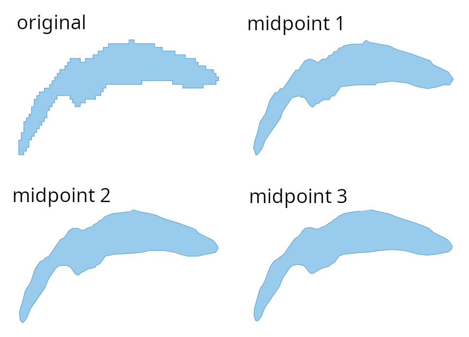

# Midpoint Smoothing

Smooth polygons by selecting the midpoint of segments.

## Overview

When using raster data from landcover datasets to make a vector landcover layer, a problem is that after polygonizing the raster data, the vector polygons will have a lot of ugly sharp corners from the pixels.

To smooth the polygon, one can take the midpoint of each segment as a new corner of the new polygon. This can be done iteratively. 

<i>Example smoothing on Lake Geneva. The original polygon has all the sharp corners from the source raster data (ESA WorldCover). When we apply the midpoint method once, a lot of corners go away. To get a smoother result, the midpoint method can be repeated.
</i>

## Online Demo

https://wipfli.github.io/midpoint-smoothing/

## Usage

`python midpoint.py`

